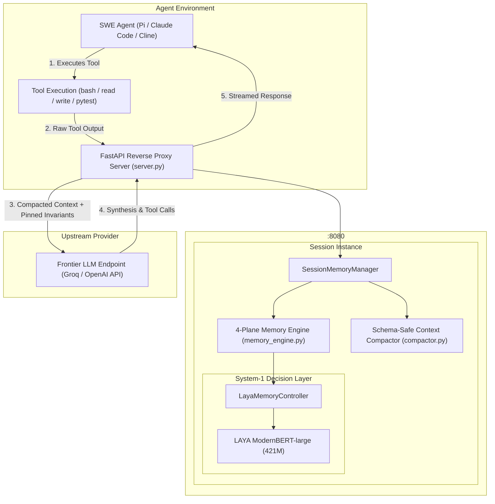
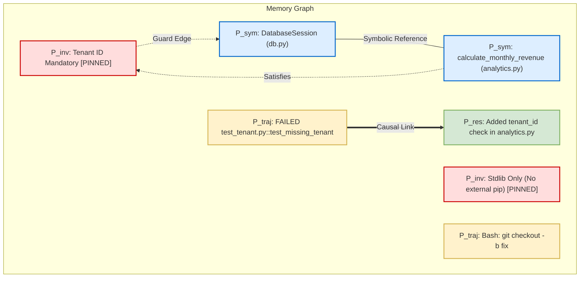
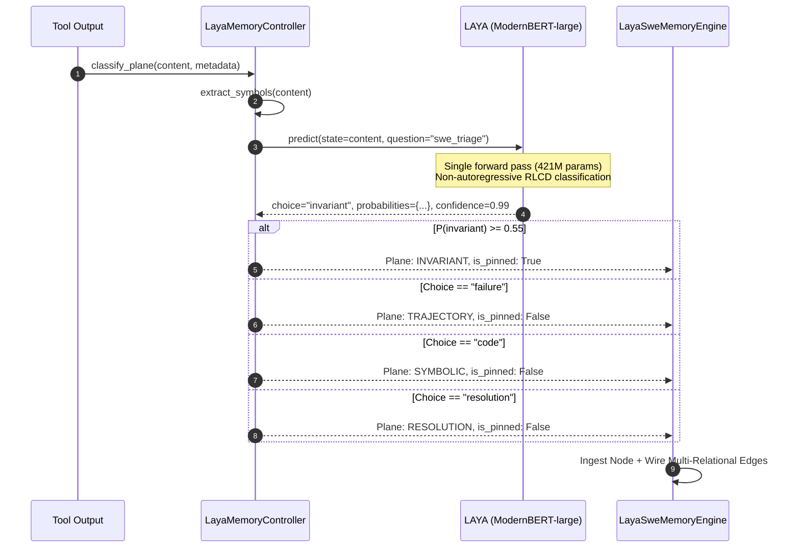
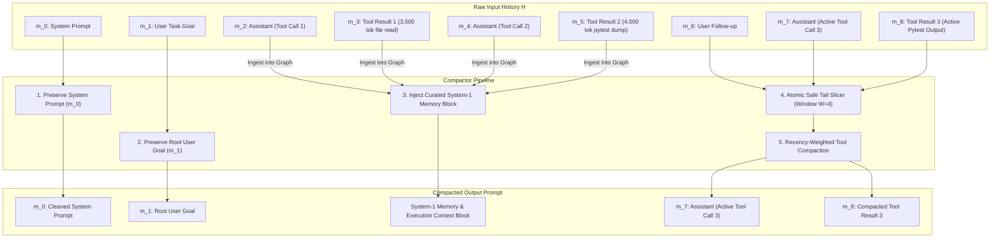

# LAYA-SWE: Technical Architecture & Systems Specification

This document provides a comprehensive technical specification of **LAYA-SWE**, an in-the-loop System-1 memory controller and reverse proxy designed for autonomous software engineering (SWE) agents.

---

## 1. System Overview & Problem Formulation

### 1.1 The Quadratic Context Problem
Autonomous coding agents (e.g., Claude Code, Cline, SWE-agent) interact with development environments via multi-turn tool-calling loops. Over extended debugging horizons, the transcript grows with large file contents, compiler tracebacks, shell outputs, and AST diffs:

$$\text{Tokens}_{\text{cumulative}}(N) = \sum_{t=1}^{N} |m_t| \propto O(N^2)$$

This cumulative token growth introduces three critical failure modes:
1. **Rate Limit Exhaustion:** Token-Per-Minute (TPM) quotas on provider endpoints (e.g., Groq, OpenAI Tier-1) are quickly breached by multi-thousand-token file reads repeated turn-over-turn.
2. **Invariant Forgetting ("Lost-in-the-Middle"):** Strict constraints (e.g., *"Do not install external dependencies"*, *"Tenant ID is mandatory on all database calls"*) are buried beneath thousands of lines of terminal dumps, causing the agent to hallucinate or violate axioms.
3. **Protocol Invalidation:** Naive truncation or sliding windows frequently sever an `assistant: tool_calls` message from its required `tool: result` counterpart, resulting in protocol rejections (`HTTP 400: Invalid parameter: tool_call_id`).

### 1.2 The Two-System Solution
LAYA-SWE addresses this with a dual-system cognitive architecture:
- **System-1 ($S_1$ - Fast Decision Model):** A resident 421M-parameter calibrated, non-autoregressive decision model (`convaiinnovations/laya`, based on ModernBERT-large) that classifies and routes observations into structured memory planes in a single forward pass ($\le 40\text{ms}$ on GPU, $\sim 1.5\text{s}$ on CPU).
- **System-2 ($S_2$ - Frontier Reasoning LLM):** Autoregressive models (e.g., `openai/gpt-oss-20b`, Claude 3.5 Sonnet) that perform complex code synthesis, reasoning over a curated, bounded prompt.



---

## 2. The 4-Plane SWE Memory Model

Instead of treating conversation history as a flat sequence or unstructured vector embeddings, LAYA-SWE partitions observations into four dedicated, orthogonal planes: $\mathcal{P} = \{P_{\text{inv}}, P_{\text{sym}}, P_{\text{traj}}, P_{\text{res}}\}$.



### 2.1 Plane Definitions & Semantics

| Plane | Formal Symbol | Content Type | Eviction Policy | Memory Type Alias |
|---|:---:|---|---|:---:|
| **Invariant Plane** | $P_{\text{inv}}$ | Negative constraints, security boundaries, architectural rules | **Pinned (`is_pinned=True`)** — Immune from LRU eviction | `constraint` |
| **Symbolic Plane** | $P_{\text{sym}}$ | Class & function signatures, AST structures, module exports | LRU eviction under memory pressure | `semantic` |
| **Trajectory Plane** | $P_{\text{traj}}$ | Shell logs, intermediate test outputs, raw tracebacks | Aggressively compacted and LRU-evicted | `episodic` |
| **Resolution Plane** | $P_{\text{res}}$ | Causal failure-to-patch pairs, verified bug fixes, passing tests | Boosted retention weight during retrieval | `preference` |

### 2.2 Memory Node Data Structure
Every observation ingested into the graph is represented by a `MemoryNode` dataclass:

```python
@dataclass
class MemoryNode:
    node_id: str                      # Unique identifier (e.g., 'mem_0042')
    content: str                      # Raw or virtualized observation text
    plane: MemoryPlane                # One of: INVARIANT, SYMBOLIC, TRAJECTORY, RESOLUTION
    timestamp: float                  # Unix epoch timestamp for LRU ordering
    symbols: List[str]                # Extracted AST symbols, paths, and identifiers
    metadata: Dict[str, Any]          # Execution metadata (tool name, exit codes, cwd)
    is_pinned: bool = False           # Pinned nodes are immune from LRU eviction
```

---

## 3. System-1 Neural State Triage

When an observation $O_t$ arrives, `LayaMemoryController` evaluates it without autoregressive token generation using `convaiinnovations/laya`.



### 3.1 Mathematical Formulation of Neural Triage
The classification decision follows:

$$\hat{y}_t = \arg\max_{c \in \mathcal{C}} P(c \mid O_t; \theta_{\text{LAYA}})$$

where $\mathcal{C} = \{\text{invariant}, \text{failure}, \text{code}, \text{log}\}$.

Because LAYA is trained using Reinforcement Learning with Calibrated Decisions (RLCD), the probability $P(\text{invariant} \mid O_t)$ is well-calibrated. An observation is pinned to $P_{\text{inv}}$ if:

$$P(\text{invariant} \mid O_t) \ge \tau_{\text{inv}} \quad \text{where } \tau_{\text{inv}} = 0.55$$

If $P(\text{invariant}) < \tau_{\text{inv}}$, the node is mapped according to its top predicted category:
- $\text{failure} \rightarrow P_{\text{traj}}$
- $\text{code} \rightarrow P_{\text{sym}}$
- $\text{log} \rightarrow P_{\text{traj}}$

### 3.2 Hybrid Safety Net
To eliminate neural misclassification risks on edge cases (e.g., regex patterns containing security keywords), `LayaMemoryController` in `laya_hybrid` mode cross-references neural output with deterministic boundary checks:
- Regex checks for explicit negative markers (`"under no circumstance"`, `"must never"`, `"strictly required"`, `"security violation"`).
- Deterministic test-pass signals (`"passed in"`, `"all tests pass"`, `"100% passing"`) ensure passing test runs route to $P_{\text{res}}$ even under ambiguous log formatting.

---

## 4. Multi-Relational Graph Engine & Retrieval

The graph engine (`LayaSweMemoryEngine`) maintains a directed multi-graph $G = (V, E)$ implemented via `networkx.MultiDiGraph`.

### 4.1 Edge Types & Scoring
When a new node $u$ is ingested, it is compared against the preceding 12 candidate nodes $\{v_i\}$ across four relation dimensions:

1. **Symbolic Overlap Edge ($e_{\text{sym}}$):** Jaccard similarity over extracted AST symbols, paths, and function names:
   $$S_{\text{sym}}(u, v) = \frac{|\text{sym}(u) \cap \text{sym}(v)|}{|\text{sym}(u) \cup \text{sym}(v)|} \times 2.5$$
2. **Invariant Guard Edge ($e_{\text{guard}}$):** Formed when either $u$ or $v$ is in $P_{\text{inv}}$ and they share symbols. Score: $0.95$.
3. **Causal Failure-Resolution Edge ($e_{\text{causal}}$):** Formed between a failure observation in $P_{\text{traj}}$ and a verified patch in $P_{\text{res}}$. Score: $0.90$.
4. **Temporal Precedence Edge ($e_{\text{temp}}$):** Directed temporal link from $v \rightarrow u$ with weight $1.0$.

Edges with score $\ge 0.5$ are inserted bidirectionally.

### 4.2 Invariant-Immune LRU Eviction
When $|V| > \text{max\_nodes}$ (default: 250), the engine executes bounded eviction:

```python
if len(self.nodes_map) > self.max_nodes:
    # Filter candidates: pinned invariant nodes are strictly immune
    unpinned_candidates = [n for n in self.nodes_map.values() if not n.is_pinned]
    if unpinned_candidates:
        evict_node = min(unpinned_candidates, key=lambda n: n.timestamp)
    else:
        evict_node = min(self.nodes_map.values(), key=lambda n: n.timestamp)

    del self.nodes_map[evict_node.node_id]
    self.graph.remove_node(evict_node.node_id)
```

**Invariant Guarantee:** Any node in $P_{\text{inv}}$ with `is_pinned = True` cannot be evicted as long as unpinned nodes exist in the graph.

### 4.3 Adaptive Retrieval with Early Stopping
When constructing the System-1 context for turn $t$ with query $q$:
1. **Mandatory Pinned Invariants:** All pinned nodes in $P_{\text{inv}}$ are automatically included.
2. **Relevance Ranking:** Unpinned candidates are scored:
   $$\text{Score}(v, q) = 4.0 \cdot |\text{sym}(q) \cap \text{sym}(v)| + 1.5 \cdot |\text{words}(q) \cap \text{words}(v)| + \text{Boost}(v.\text{plane})$$
   where $\text{Boost}(P_{\text{res}}) = 2.5$ and $\text{Boost}(P_{\text{sym}}) = 1.5$.
3. **Adaptive Stopping:** Evidence accumulation terminates early if symbol coverage reaches $\ge 60\%$ and at least one invariant is retained:
   $$\text{Coverage}(q, \mathcal{S}) = \frac{|\text{sym}(q) \cap \bigcup_{s \in \mathcal{S}} \text{sym}(s)|}{|\text{sym}(q)|} \ge 0.60$$

---

## 5. Schema-Safe Context Compaction

The `ContextCompactor` transforms a potentially unbounded conversation history $H = [m_0, m_1, \dots, m_T]$ into a bounded prompt $H_{\text{compact}}$ compliant with provider APIs.



### 5.1 Safe Tail Slicing Algorithm
Standard sliding windows break when they slice into the middle of a `tool_calls` / `tool` interaction. The compactor guarantees atomic pairing:

```python
start_idx = max(0, len(history) - self.max_tail_messages)

# Backward scan: never allow the tail to start with an orphaned 'tool' message
while start_idx > 0 and history[start_idx].get("role") == "tool":
    start_idx -= 1

raw_tail = history[start_idx:]
```

### 5.2 Recency-Weighted Compaction
Inside the safe tail window, observations are compacted based on recency:
- **Active / Most Recent Observation:** Kept at high fidelity (up to 1,200 chars for pytest outputs, 8,000 chars for file reads).
- **Intermediate Observations in Tail:** Aggressively compacted down to 400 chars, retaining only function signatures, failure lines, or exit codes.

### 5.3 Assembled Context Format
The assembled prompt injected into System-2 takes the form:

```text
[Role: system]
You are a helpful software engineering assistant.

[Role: user]
Implement tenant-scoped revenue reporting across app/analytics.py and app/db.py.

[Role: system]
=== LAYA-SWE (SYSTEM-1 MEMORY & EXECUTION CONTEXT) ===
• [INVARIANT [PINNED]] CRITICAL INVARIANT: DatabaseSession requires tenant_id. Queries without tenant_id raise SecurityError.
• [SYMBOLIC] class DatabaseSession: def query(self, tenant_id=None)...
• [RESOLUTION] Fixed eviction order in cache/lru_manager.py. All tests pass.
======================================================

[Role: assistant]  (Tool Call: bash)
[Role: tool]       (Tool Result: pytest output)
```

---

## 6. Reverse Proxy & Concurrency Architecture

The reverse proxy (`proxy/server.py`) exposes an OpenAI-compatible HTTP interface on port `8080`.

### 6.1 Multi-Agent Session Isolation
Multi-tenant and multi-agent workflows are isolated via `SessionMemoryManager`:

```python
class SessionMemoryManager:
    def __init__(self):
        self._sessions: Dict[str, Tuple[LayaSweMemoryEngine, ContextCompactor]] = {}
        self._manager_lock = threading.Lock()

    def get_or_create(self, session_id: str, ...):
        with self._manager_lock:
            if session_id not in self._sessions:
                # Allocates dedicated graph and compactor per agent session
                ...
            return self._sessions[session_id]
```

Session IDs are derived from request headers (`X-Session-ID`, `X-Task-ID`) or conversation hashes, ensuring zero cross-agent context contamination.

### 6.2 Asynchronous Event Loop Protection
Because AST extraction and tokenizer encoding are CPU-bound, the proxy offloads compaction to Python's background worker threads:

```python
compacted_msgs, raw_tok, sent_tok = await asyncio.to_thread(
    active_compactor.process_and_compact,
    messages,
    compaction_enabled
)
```

This prevents the FastAPI async event loop from blocking concurrent HTTP requests during large token compactions.

### 6.3 Strict Model Invariance & Telemetry
To guarantee rigorous experimental control:
- No silent failover between model families or providers.
- The exact model dispatched upstream is returned in the `X-Upstream-Model` header.
- Turn telemetry (raw tokens, sent tokens, savings %, latency) is appended to `benchmark_telemetry.jsonl` under an `asyncio.Lock()`.

---

## 7. Empirical Validation & Benchmarks

LAYA-SWE was evaluated on a 4-candidate $\times$ 5-task benchmark matrix running live requests against `openai/gpt-oss-20b` on Groq hardware:

### 7.1 Verified Scorecard

| Candidate Architecture | Invariant Retention | Avg Token Savings | Pytest Pass Rate | Avg Turn Latency |
|---|:---:|:---:|:---:|:---:|
| **Candidate A: Full Context (Control)** | 100.0% | 0.00% | 100.0% (18/18) | 1.53s |
| **Candidate B: Heuristic Structural** | 100.0% | 10.02% | 100.0% (18/18) | 1.47s |
| **Candidate C: Pure Neural LAYA** | 80.0% | 12.13% | 100.0% (18/18) | 7.24s |
| **Candidate D: LAYA-SWE Hybrid** | **100.0%** | **12.72%** (Peak 17.5%) | **100.0% (18/18)** | 5.52s |

### 7.2 Key Empirical Finding: The Pure Neural Retention Deficit
Candidate C (Pure Neural LAYA) achieved 12.13% token savings, but dropped to an **80.0% Invariant Retention Rate** on Task 3 (multi-threaded race debugging). Under high-noise shell output, pure neural classification misclassified a negative concurrency constraint as a transient log. 

**Candidate D (LAYA-SWE Hybrid)** combines calibrated probability thresholding ($P(\text{invariant}) \ge 0.55$) with deterministic invariant immunity and AST symbol extraction, achieving **100% Invariant Retention** and the highest token reduction (**12.72%** average, **17.5%** peak).

---

## 8. Integration Reference

### Option A: Reverse Proxy (Zero Code Modification)
Point any OpenAI-compatible agent SDK to the local proxy:

```python
from openai import OpenAI

client = OpenAI(
    base_url="http://127.0.0.1:8080/v1",
    api_key=os.getenv("GROQ_API_KEY")
)

response = client.chat.completions.create(
    model="openai/gpt-oss-20b",
    messages=conversation_history
)
```

### Option B: Native Agent Hook (`extensions/laya-swe.ts`)
For TypeScript-based coding agents (e.g., Pi Coding Agent):

```typescript
import layaSweExtension from "./extensions/laya-swe";

// Registers lifecycle hooks for tool results and context assembly
pi.registerExtension(layaSweExtension);
```
