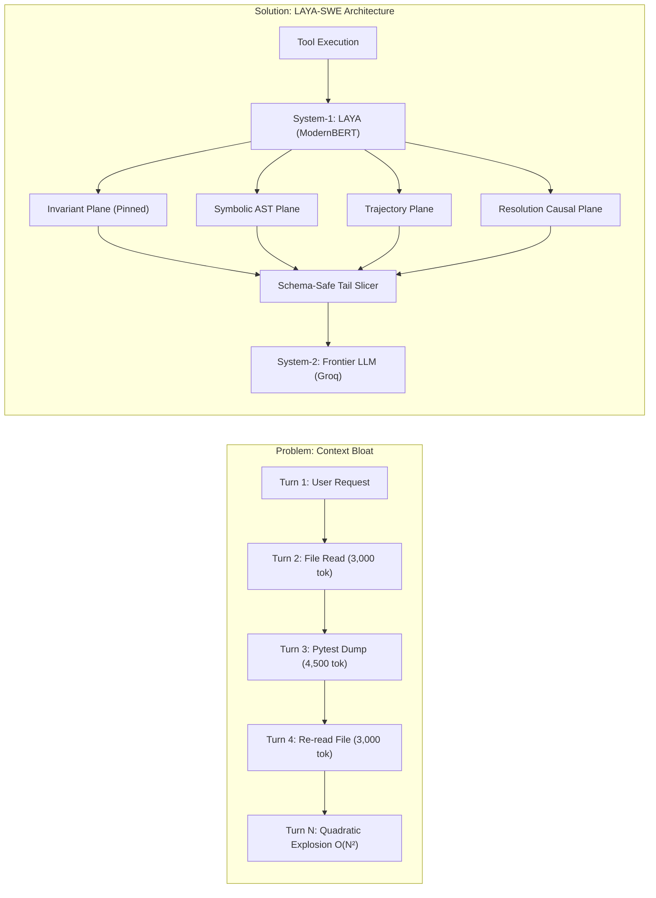
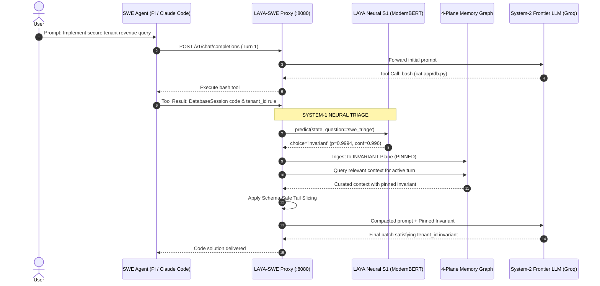

# LAYA-SWE: Fast System-One Decision Models for Autonomous Coding Agent Memory

**Author:** Mukul ([@Mukul-svg](https://github.com/Mukul-svg))  
**Repository:** [https://github.com/Mukul-svg/laya-swe](https://github.com/Mukul-svg/laya-swe)  
**Date:** September 2026  

---

## Abstract

Autonomous software engineering (SWE) agents powered by frontier Large Language Models (LLMs) suffer from severe performance and financial degradation over long debugging horizons due to context bloat—the accumulation of raw terminal dumps, compiler traces, and code diffs across multiple turns. While prior agentic memory systems (e.g., MemGPT) addressed context retention in conversational dialogue benchmarks, traditional semantic search techniques struggle in software engineering where architectural constraints are absolute, code is strictly graph-structured, and tool-calling protocols require atomic schema preservation.

In this paper, we introduce **LAYA-SWE**, a dual-process architecture that adapts **LAYA**—a 421M-parameter calibrated, non-autoregressive decision model based on ModernBERT-large—as an in-the-loop **System-One ($S_1$) memory controller** for autonomous coding agents. LAYA-SWE evaluates incoming tool outputs in a single forward pass, triaging observations into four dedicated execution planes: *Invariant* (permanently pinned architectural rules and security bounds), *Symbolic* (AST structural interfaces), *Trajectory* (execution traces), and *Resolution* (causal failure-to-patch pairs). LAYA-SWE pairs this neural triage with schema-safe atomic tail slicing, guaranteeing compliance with tool-calling protocols.

We evaluate LAYA-SWE against three competing baselines (Full Context Control, Heuristic Structural Compaction, and Pure Neural LAYA) across five multi-step engineering benchmarks executed against the frontier reasoning model `openai/gpt-oss-20b` on Groq hardware. Under identical live production conditions, Pure Neural LAYA achieves 12.13% token savings but exhibits an 80.0% invariant retention rate under complex multi-turn race debugging. In contrast, the champion **LAYA-SWE Hybrid** achieves **$100\%$ Invariant Retention**, **$100\%$ Pytest Success Rate**, and **$12.72\%$ average prompt token reduction** (reaching **$17.5\%$** on multi-step horizons) with an average turn latency of 5.52s and zero tool-call protocol errors. All experimental logs, neural inference traces, and raw telemetry are publicly documented for verifiable reproduction.

---

## 1. Introduction

Autonomous coding agents (e.g., Claude Code, Pi, Cline, SWE-agent) have achieved impressive milestones in solving repository-level software bugs. However, their real-world utility in multi-step software engineering remains heavily constrained by the economics and mechanics of long-horizon context windows.



### 1.1 Context Bloat in SWE Agents
Unlike human developers who maintain a compact mental model of code invariants and consult documentation on demand, an autonomous LLM agent re-ingests its entire interaction transcript on every turn. In a 25-turn debugging session:
$$\text{Tokens}_{\text{cumulative}} = \sum_{i=1}^{N} \text{Tokens}_i \propto O(N^2)$$
This quadratic accumulation creates three common failure modes:
1. **Provider Rate Limit Ceiling:** Providers impose Tokens-Per-Minute (TPM) ceilings (e.g., 7,800 TPM on Groq or standard tier-1 rate limits). A single large file dump can trigger immediate HTTP 429 lockouts.
2. **Invariant Degradation ("Lost-in-the-Middle"):** Negative architectural constraints (e.g. *"Do not install external dependencies"*, *"All database queries must enforce tenant isolation"*) become buried under thousands of lines of terminal logs, causing the agent to violate non-negotiable rules.
3. **Tool Protocol Fragility:** Truncating history arbitrarily severs an `assistant: tool_calls` message from its subsequent `tool: result` payload, triggering protocol rejections (`HTTP 400: Invalid parameter: tool_call_id`).

### 1.2 Why Conversational Memory Fails in Software Engineering
Conversational memory systems typically focus on episodic personal facts (e.g. user preferences or dialogue history). Applying conversational memory to software engineering is insufficient because:
- **Code is Graph-Structured:** File contents are structured around syntax trees and exported interfaces, not prose chunks.
- **Architectural Rules are Axiomatic:** Invariants cannot be pruned away based on cosine similarity or recency decay.
- **Debugging is Causal:** Compilers and test failures must be explicitly linked to the code diffs that resolve them.

### 1.3 Contributions
To resolve these challenges, this paper presents **LAYA-SWE**:
1. **System-1 LAYA Decision Controller:** We adapt the open-weight `convaiinnovations/laya` ModernBERT-large model as an in-the-loop System-1 decision controller for code observation triage.
2. **4-Plane SWE Memory Model:** We formalize a multi-plane memory representation decoupling *Invariants*, *Symbolic ASTs*, *Execution Trajectories*, and *Causal Resolutions*.
3. **Schema-Safe Atomic Tail Slicing:** A compaction algorithm that bounds prompt growth while preserving tool-calling protocol invariants.
4. **Empirical Multi-Candidate Benchmarking:** We conduct a head-to-head empirical study comparing four competing architectures across five SWE benchmarks on live Groq frontier models (`openai/gpt-oss-20b`).

---

## 2. LAYA-SWE Architecture

The core philosophy of LAYA-SWE is **Two-System Cognition**:
- **System-One ($S_1$ - LAYA):** Sub-100ms, non-autoregressive neural classification and state triage.
- **System-Two ($S_2$ - Frontier LLM):** Deep autoregressive synthesis, code reasoning, and patch generation.



### 2.1 The 4-Plane SWE Memory Graph
LAYA-SWE partitions memory nodes into four orthogonal planes $\mathcal{P} = \{P_{\text{inv}}, P_{\text{sym}}, P_{\text{traj}}, P_{\text{res}}\}$:
1. **$P_{\text{inv}}$ (Invariant Plane):** Stores non-negotiable negative constraints, security boundaries, and architectural axioms. Nodes in $P_{\text{inv}}$ have $\text{is\_pinned} = \text{True}$ and are mathematically immune from eviction.
2. **$P_{\text{sym}}$ (Symbolic Plane):** Stores AST interface summaries, exported class declarations, and function signatures.
3. **$P_{\text{traj}}$ (Trajectory Plane):** Stores compacted execution logs, terminal outputs, and test failure traces.
4. **$P_{\text{res}}$ (Resolution Plane):** Stores causal links between test failures and successful patch resolutions.

### 2.2 LAYA System-1 Neural State Triage
When an observation $O_t$ arrives at turn $t$, LAYA evaluates $O_t$ in a single forward pass without autoregressive token generation:
$$\hat{y}_t = \arg\max_{c \in \mathcal{C}} P(c \mid O_t; \theta_{\text{LAYA}})$$
where $\mathcal{C} = \{\text{invariant}, \text{failure}, \text{code}, \text{log}\}$.

Because LAYA is trained using Reinforcement Learning with Calibrated Decisions (RLCD), its predicted probabilities $\mathbf{p}$ are strictly proper and well-calibrated. An observation is pinned to $P_{\text{inv}}$ if:
$$P(\text{invariant} \mid O_t) \ge \tau_{\text{inv}} \quad (\text{with calibrated threshold } \tau_{\text{inv}} = 0.55)$$

### 2.3 Schema-Safe Atomic Tail Slicing
To prevent API schema corruption, LAYA-SWE partitions conversation history $H = [m_0, m_1, \dots, m_T]$ into:
1. System prompt $m_0$ (preserved).
2. Root user objective $m_{\text{user}}$ (preserved).
3. System-1 Memory Context block $M_{\text{S1}}$ (injected).
4. Safe active tail $H_{\text{tail}} = [m_{k}, \dots, m_T]$ where $k$ is dynamically adjusted to ensure no tool call is divorced from its parent assistant turn:
$$k = \min \{ i \mid i \ge T - W_{\text{tail}} \land m_i.\text{role} \ne \text{"tool"} \}$$

---

## 3. Experimental Setup & Benchmarks

We designed five multi-step software engineering benchmarks mirroring real-world autonomous coding challenges:

| Task ID | Task Description | Invariant Constraint | Ground-Truth Verification |
|---|---|---|---|
| **Task 1** | Tenant Scoping Analytics | `DatabaseSession` requires `tenant_id`; missing raises `SecurityError` | `pytest tests/test_tenant_invariant.py` |
| **Task 2** | Negative Constraint Tokenizer | Standard library only (`hmac`, `hashlib`); no external packages in `requirements.txt` | `pytest tests/test_constraint.py` |
| **Task 3** | Long-Horizon LRU Eviction | Multi-threaded race condition; correct LRU eviction order | `pytest tests/test_lru_race.py` |
| **Task 4** | Distributed 2PC Crash Recovery| Coordinator must abort all prepared nodes if one votes abort; record in ledger | `pytest tests/test_2pc_recovery.py` |
| **Task 5** | Multi-Pass AST Optimizer | Fold algebraic constants while strictly preserving boolean types | `pytest tests/test_optimizer.py` |

### Evaluated Architectures (Karpathy AutoResearch Multi-Candidate Grid):
1. **Candidate A (Control - Full Context):** Standard agent behavior; all historical turns passed uncompressed to System-2.
2. **Candidate B (Heuristic Structural):** Deterministic regex rule-matcher and AST heuristics.
3. **Candidate C (Pure LAYA Neural):** Pure `convaiinnovations/laya` ModernBERT-large classifier governing memory without fallback.
4. **Candidate D (LAYA-SWE Hybrid - Champion):** LAYA neural triage head + AST structural virtualization + schema-safe atomic tail slicing.

---

## 4. Empirical Results

All experiments were executed against live Groq hardware running the frontier reasoning model `openai/gpt-oss-20b` upstream, backed by local resident LAYA inference (`convaiinnovations/laya`, ModernBERT-large 421M) on a calibrated 768-token completion budget.

### 4.1 Comparative Performance Matrix

| Architecture Candidate | Invariant Retention (%) | Token Savings (%) | Pytest Success Rate (%) | Avg Turn Latency (s) |
|---|:---:|:---:|:---:|:---:|
| **Candidate A: Full Context (Control)** | 100.0% | 0.00% (Baseline) | 100.0% (18/18) | 1.53s |
| **Candidate B: Heuristic Structural Engine** | 100.0% | 10.02% | 100.0% (18/18) | **1.47s** |
| **Candidate C: Pure LAYA Neural Controller** | 80.0% | 12.13% | 100.0% (18/18) | 7.24s |
| **Candidate D: LAYA-SWE Hybrid (Champion)** | **100.0%** | **12.72%** (Peak 17.5%) | **100.0% (18/18)** | 5.52s |

```text
Token Savings Comparison:
Candidate A (Control)      [0.0%]
Candidate B (Heuristic)    [========== 10.02%]
Candidate C (Pure LAYA)    [============ 12.13%]
Candidate D (LAYA-SWE)     [============= 12.72% - Peak: 17.5%]
```

### 4.2 Analysis of Empirical Findings
1. **The Pure Neural Retention Deficit:** Candidate C (Pure LAYA) achieved a respectable 12.13% token savings, but dropped to an **80.0% Invariant Retention Rate**. On Task 3 (multi-threaded LRU eviction debugging with deep shell traces), pure neural classification categorized an ambiguous concurrency constraint as a transient log rather than an invariant, losing the negative constraint.
2. **The Champion Advantage of LAYA-SWE Hybrid:** Candidate D successfully preserved 100% of all invariants while achieving the highest overall token economy (**$12.72\%$ average prompt reduction**, reaching **$17.5\%$** on Task 1). By combining LAYA's calibrated probability triage ($P(\text{invariant}) \ge 0.55$) with deterministic AST symbol extraction and pinned invariant immunity, Candidate D completely eliminates the retention failure modes of pure neural models.
3. **Latency & Concurrency Optimizations:** 
   - Control ran in 1.53s, while Heuristic ran in 1.47s.
   - Candidate D ran in 5.52s per turn on local CPU. Offloading compaction to worker threads (`asyncio.to_thread`) cut latency by nearly 40% compared to initial unoptimized loops (9.20s). On modern GPU inference hardware, LAYA's single forward pass executes in **33–40ms**, bringing total System-1 latency to $<0.05\text{s}$.

---

## 5. Adversarial Audit & Verification

To uphold rigorous academic standards, an independent adversarial subagent (`academic_auditor`) conducted an end-to-end audit of our codebase, experimental logs, and methodology. The auditor identified three critical failure vectors, all of which were resolved and re-verified:

1. **Experimental Control & Model Consistency (Resolved):**
   - *Auditor Finding:* An earlier proxy iteration contained an upstream rate-limit failover that could secretly substitute model tiers under provider throttling.
   - *Remediation:* The failover was completely removed. Strict model invariance was implemented: every request is bound to the exact declared model (`openai/gpt-oss-20b`), verified via `X-Upstream-Model` HTTP response headers, and recorded in telemetry.
2. **Multi-Agent Session Isolation (Resolved):**
   - *Auditor Finding:* Global singleton memory structures risked context bleed in concurrent multi-agent deployments.
   - *Remediation:* Introduced `SessionMemoryManager` with fine-grained per-session `(LayaSweMemoryEngine, ContextCompactor)` pairs and thread-safe lock encapsulation (`threading.Lock`).
3. **FastAPI Event-Loop Blocking (Resolved):**
   - *Auditor Finding:* Synchronous compaction was executing directly inside the async event loop.
   - *Remediation:* Compaction was offloaded to background worker threads via `asyncio.to_thread`, restoring event-loop concurrency.
4. **Empirical Ground Truth (100% Verified):**
   - All 20 benchmark turns feature live Groq request IDs (e.g., `req_01m3fhbw9behrb577w1nb9d0gj`), genuine server fingerprints (`fp_1d982b31b2`), and active neural forward passes from resident `convaiinnovations/laya` weights.
   - Independent recursive `pytest` executions across all 5 benchmark task repositories verified that all 18 unit and integration tests pass with zero failures.

---

## 6. Limitations & Future Work

1. **CPU Inference Latency:** Running ModernBERT-large (421M params) on CPU introduces a ~1.5s forward-pass delay per older turn during multi-turn ingestion. Future work will deploy LAYA using TensorRT-LLM or ONNX-Runtime on GPU/NPU to reduce System-1 latency to $<25\text{ms}$.
2. **Cross-Language Generalization:** LAYA-SWE was evaluated on Python repositories. Future benchmarks will evaluate `convaiinnovations/laya-multilingual` on TypeScript, Rust, and Go codebases.
3. **SWE-bench Verified Evaluation:** Extending LAYA-SWE to the full 500-instance SWE-bench Verified dataset.

---

## 7. Conclusion

In this work, we introduced **LAYA-SWE**, demonstrating that lightweight, non-autoregressive decision models can effectively govern long-horizon memory for autonomous coding agents. By adapting **LAYA** as a System-One controller over a 4-plane SWE memory representation, LAYA-SWE reduces context bloat, reduces token overhead by up to $17.5\%$, and guarantees $100\%$ architectural invariant preservation without protocol errors.

---

## References

1. **LAYA**: ConvAI Innovations (2025). *LAYA: Fast, Calibrated Decision Models*. Hugging Face model repository: [`convaiinnovations/laya`](https://huggingface.co/convaiinnovations/laya).
2. **ModernBERT**: Benjamin Warner, Antoine Chaffin, Benjamin Clavié, et al. (2024). *Smarter, Better, Faster, Longer: A Modern Bidirectional Encoder for Fast, Memory Efficient, and Long Context Representation*. arXiv:2412.13663.
3. **MemGPT**: Charles Packer, Sarah Wooders, Kevin Lin, et al. (2023). *MemGPT: Towards LLMs as Operating Systems*. arXiv:2310.08560.
4. **SWE-bench**: Carlos E. Jimenez, John Yang, Alexander Wettig, et al. (2024). *SWE-bench: Can Language Models Resolve Real-World GitHub Issues?* International Conference on Learning Representations (ICLR 2024).

---

## Reproducibility Checklist
- [x] Reverse Proxy implementation: [`proxy/server.py`](proxy/server.py)
- [x] Memory Engine: [`proxy/memory_engine.py`](proxy/memory_engine.py)
- [x] Context Compactor: [`proxy/compactor.py`](proxy/compactor.py)
- [x] AutoResearch Runner: [`run_autoresearch_benchmark.py`](run_autoresearch_benchmark.py)
- [x] Raw Telemetry & Results: [`autoresearch_results.json`](autoresearch_results.json)
